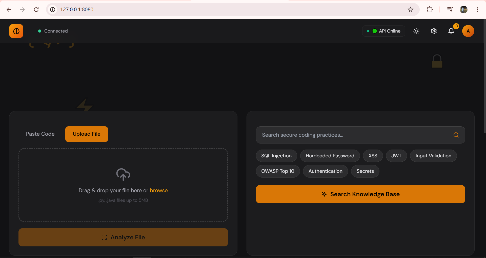
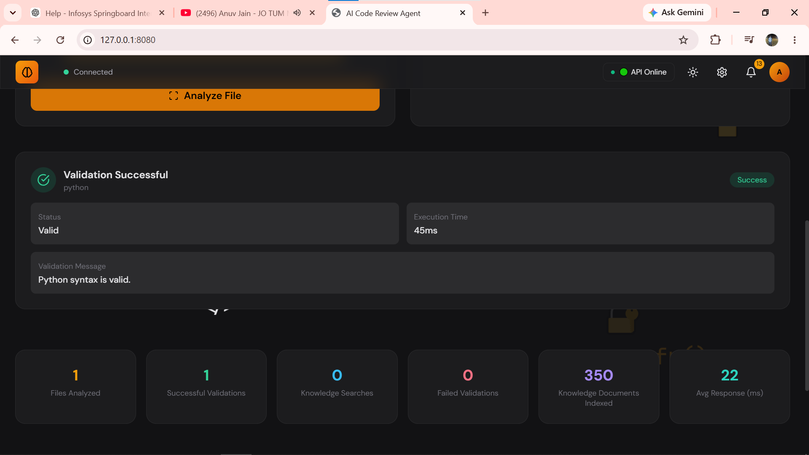
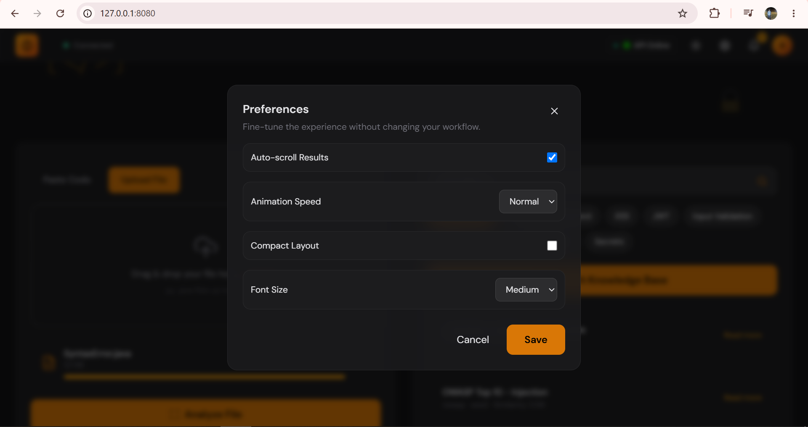

# AI Code Review & Security Analysis Agent


An AI-powered Code Review and Security Analysis application that validates Python and Java source code, detects syntax errors, and provides secure coding recommendations using a Retrieval-Augmented Generation (RAG) knowledge base powered by ChromaDB.

---

# Features

- Python Syntax Validation
- Java Syntax Validation
- File Upload Support (.py and .java)
- Paste Code Validation
- Secure Coding Knowledge Base Search
- OWASP Top 10 Recommendations
- AI-assisted Error Explanation
- Suggested Fixes for Validation Errors
- Validation Statistics Dashboard
- Dark & Light Theme Support
- Responsive Modern User Interface
- Settings Panel
- Recent Activity Tracking

---

# Technology Stack

## Frontend

- HTML5
- CSS3
- JavaScript

## Backend

- Python 3.12
- FastAPI
- Uvicorn

## AI & Knowledge Base

- ChromaDB
- Sentence Transformers
- Retrieval-Augmented Generation (RAG)

## Validation

- Python AST Parser
- Java Syntax Validator (javalang)

---

# Project Structure

```text
AI-Code-Review-Agent/
│
├── backend/
│   ├── routes.py
│   ├── app.py
│   ├── services/
│   └── validators/
│
├── frontend/
│   ├── index.html
│   ├── style.css
│   └── script.js
│
├── knowledge_base/
│
├── rag/
│
├── tests/
│
├── vector_db/
│
├── uploads/
│
├── docs/
│   └── screenshots/
│       ├── Home.png
│       ├── Validate.png
│       ├── Error Fix.png
│       ├── Knowledge Base.png
│       ├── Settings.png
│       ├── Bottom Page.png
│       └── White Theme.png
│
├── requirements.txt
├── README.md
├── LICENSE
└── .gitignore
```

---

# Installation

## Clone Repository

```bash
git clone https://github.com/<your-username>/AI-Code-Review---Security-Analysis-Agent.git

cd AI-Code-Review---Security-Analysis-Agent
```

---

## Create Virtual Environment

Windows

```bash
python -m venv .venv
```

Activate

```bash
.venv\Scripts\activate
```

---

## Install Dependencies

```bash
pip install -r requirements.txt
```

---

# Running the Project

## Start Backend

Run the backend using the same command that was used during development:

```bash
uvicorn backend.app:app --reload
```

Backend API

```
http://127.0.0.1:8000
```

API Documentation

```
http://127.0.0.1:8000/docs
```

---

## Start Frontend

Open a new terminal.

Run:

```bash
python -m http.server 8080 --directory frontend
```

Open

```
http://127.0.0.1:8080
```

---

# Screenshots

## Dashboard

Main application interface with code upload, validation, and secure coding search.



---

## Code Validation

Validation results for Python and Java source files.



---

## Error Detection & Suggested Fix

Displays syntax errors with their location, severity, and suggested fixes.


---

## Secure Coding Knowledge Base

Semantic search across OWASP guidelines and secure coding documents.


---

## User Preferences

Customize the interface using built-in settings.



---

## Analytics Dashboard

Displays validation statistics and recent activity.


---

## Light Theme

Complete application in Light Mode.


---

# API Endpoints

| Method | Endpoint | Description |
|---------|----------|-------------|
| GET | / | API Status |
| GET | /api/status | Backend Status |
| POST | /api/validate/paste | Validate pasted code |
| POST | /api/validate/upload | Validate uploaded file |
| POST | /api/knowledge/search | Search secure coding knowledge base |

---

# Future Enhancements

- AI Code Quality Analysis
- Security Vulnerability Detection
- GitHub Repository Integration
- User Authentication
- AI Code Review Reports
- Multi-language Support
- PDF Report Generation
- Export Analysis Results
- Real-time Code Suggestions

---

# Author

**Sahil Pandey**

GitHub:
https://github.com/sahil-0404

LinkedIn:
https://www.linkedin.com/in/sahil-pandey-bb745a3a3

---

# License

This project is licensed under the MIT License.

See the LICENSE file for complete details.
