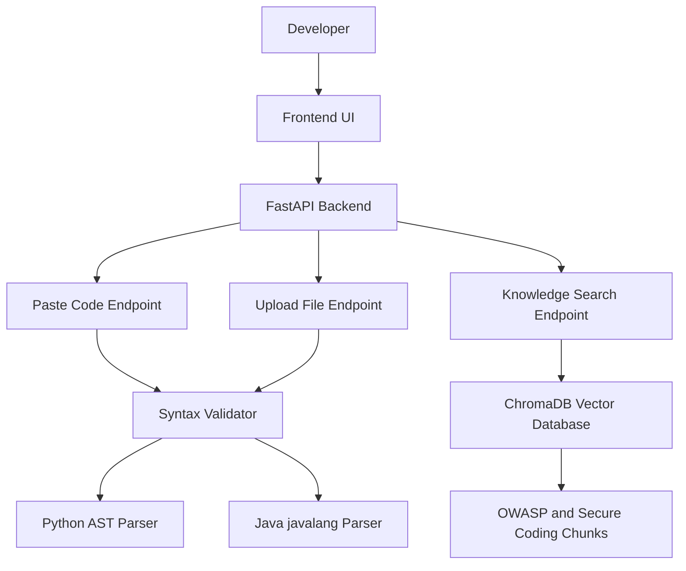
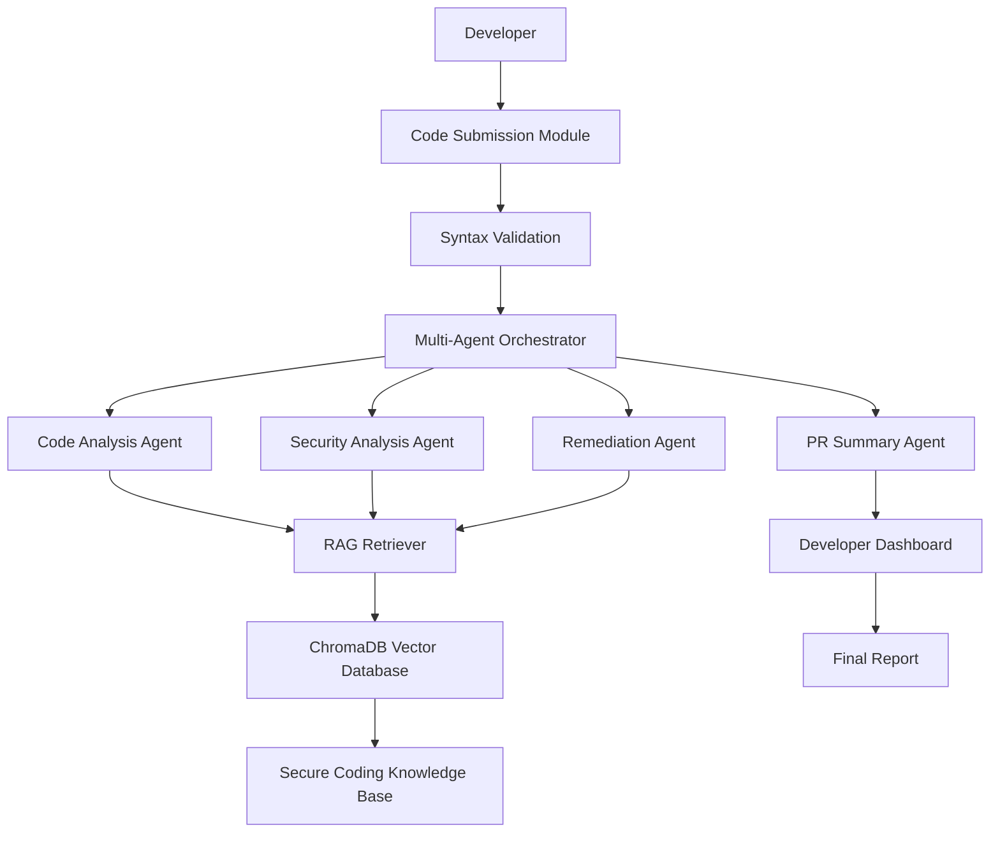

# Architecture

## Milestone 1 Architecture

```mermaid
flowchart TD
    A["Developer"] --> B["Frontend UI"]
    B --> C["FastAPI Backend"]
    C --> D["Paste Code Endpoint"]
    C --> E["Upload File Endpoint"]
    D --> F["Syntax Validator"]
    E --> F
    F --> G["Python AST Parser"]
    F --> H["Java javalang Parser"]
    C --> I["Knowledge Search Endpoint"]
    I --> J["ChromaDB Vector Database"]
    J --> K["OWASP and Secure Coding Chunks"]
```

## Full Project Architecture For Later Milestones

```mermaid
flowchart TD
    A["Developer"] --> B["Code Submission Module"]
    B --> C["Syntax Validation"]
    C --> D["Multi-Agent Orchestrator"]
    D --> E["Code Analysis Agent"]
    D --> F["Security Analysis Agent"]
    D --> G["Remediation Agent"]
    D --> H["PR Summary Agent"]
    E --> I["RAG Retriever"]
    F --> I
    G --> I
    I --> J["ChromaDB Vector Database"]
    J --> K["Secure Coding Knowledge Base"]
    H --> L["Developer Dashboard"]
    L --> M["Final Report"]
```
